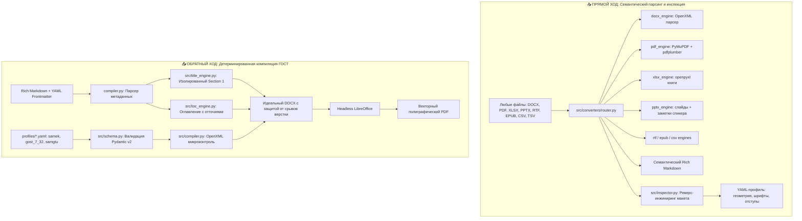

# 🛠️ Doc-Forge: Универсальный двусторонний компилятор и инспектор документов (ГОСТ / СТО)

[](flake.nix)
[](flake.nix)
[](profiles/)
[](LICENSE)

**Doc-Forge** — комплексная программная платформа для **двусторонней конвертации**, **реверс-инжиниринга макетов** и **детерминированной компиляции** академических и корпоративных документов (курсовые, дипломы, отчеты о НИР, технические задания) в строгом соответствии с отечественными требованиями нормоконтроля (**ГОСТ 7.32-2017**, **ГОСТ 2.105-2019**, **СТО СаМеК**, **СТО СамГТУ**).

Платформа спроектирована как единая точка входа для людей и AI-агентов (Oh My Pi, Antigravity, Zed), объединяя скоростной семантический парсинг 8+ офисных форматов и микроконтроль над разметкой Microsoft OpenXML.

---

## 🏛️ Архитектура системы



---

## ⚡ Быстрое сравнение: Почему не Pandoc?

| Критерий нормоконтроля | Pandoc (`docx-pandoc`) | Typst (`typst-pdf`) | **Doc-Forge** |
| :--- | :---: | :---: | :---: |
| **Изолированный титульный лист** | ❌ Сквозная нумерация | ⚠️ Требует скриптов | ✅ **Да** (Section 1 без номеров и колонтитулов) |
| **Сетка подписей студента/руководителя** | ❌ Разъезжается | ⚠️ Ручная верстка | ✅ **Да** (2-колоночная безрамочная таблица) |
| **Оглавление с отточиями (`WD_TAB_LEADER.DOTS`)** | ⚠️ Только поле TOC | ✅ Нативно | ✅ **Да** (нативная табуляция по правому краю) |
| **Защита от висячих заголовков (`w:keepNext`)** | ❌ Нет | ✅ Нативно | ✅ **Да** (принудительно для всех H1–H3) |
| **Защита от висячих строк (`w:widowControl`)** | ❌ Нет | ✅ Нативно | ✅ **Да** (включена для каждого абзаца) |
| **Повтор шапки таблицы на новой стр. (`w:tblHeader`)** | ❌ Нет | ✅ Нативно | ✅ **Да** (автоматически для всех таблиц) |
| **Поля ГОСТ (30 мм левое, 10 мм правое, 20/20)** | ⚠️ Через template.docx| ⚠️ Ручные margin | ✅ **Да** (декларативные YAML-профили) |
| **Реверс-инжиниринг чужих образцов в YAML** | ❌ Нет | ❌ Нет | ✅ **Да** (`doc-forge inspect obrazets.docx`) |
| **Конвертация XLSX / PPTX со слайдами и формулами** | ❌ Нет | ❌ Нет | ✅ **Да** (`doc-forge convert`) |

---

## 🚀 Глобальный запуск и интеграция в ОС

В системе `detker-nixos` утилита зарегистрирована глобально в `PATH` (`~/.local/bin/doc-forge`). Она использует кэшированное изолированное Python-окружение Nix Store и запускается **из любого каталога терминала за 0.3–1.0 секунды**.

```bash
# Проверка доступности из произвольной папки:
doc-forge --help
```

### Разработка через Nix Flake DevShell
Если требуется модифицировать исходный код компилятора:
```bash
cd ~/Документы/repository/doc-forge

# Активация изолированного окружения со всеми зависимостями:
nix develop
# или: python3 src/cli.py --help
```

---

## 💻 Полный справочник команд CLI

### 1. `doc-forge build` — Сборка Markdown в DOCX и PDF
Детерминированная компиляция документа по выбранному стандарту оформления.

```bash
# 1. Сборка курсовой/отчета СаМеК в DOCX
doc-forge build work.md -p samek -o output.docx

# 2. Сборка DOCX + мгновенный экспорт в финальный векторный PDF через LibreOffice
doc-forge build work.md -p samek -o output.docx --pdf

# 3. Сборка академического отчета о НИР по ГОСТ 7.32-2017
doc-forge build report.md -p gost_7_32 -o report.docx --pdf

# 4. Сборка с явным указанием пути к кастомному профилю
doc-forge build doc.md -p /path/to/custom_profile.yaml -o doc.docx
```

**Ключевые флаги `build`:**
- `-p, --profile`: Имя встроенного профиля (`samek`, `gost_7_32`, `samgtu`) или путь к любому `.yaml` файлу. Если не указан, профиль считывается из Frontmatter документа (`profile: samek`).
- `-o, --output`: Путь к результирующему `.docx` файлу (по умолчанию `<имя_входа>.docx`).
- `--pdf / --no-pdf`: Автоматический экспорт в PDF с тем же именем (по умолчанию выключен).

---

### 2. `doc-forge convert` — Прямая конвертация 8+ форматов в Markdown
Универсальный семантический конвертер любых офисных файлов в чистый Rich Markdown с извлечением таблиц, списков, заголовков и авто-сохранением извлеченного макета в YAML.

```bash
# Конвертация PDF (извлечение текста, таблиц и шрифтового анализа)
doc-forge convert document.pdf -o document.md

# Конвертация чужого DOCX с сохранением извлеченного макета в профиль
doc-forge convert sample.docx -o sample.md -p profiles/extracted.yaml

# Конвертация многостраничной книги Excel (листы -> секции Markdown, формулы, сетки)
doc-forge convert finance.xlsx -o finance.md

# Конвертация презентации PowerPoint (слайды + заметки спикера)
doc-forge convert lecture.pptx -o lecture.md

# Конвертация RTF, EPUB или CSV
doc-forge convert book.epub -o book.md
doc-forge convert data.csv -o data.md
```

**Ключевые флаги `convert`:**
- `-o, --output`: Путь для сохранения `.md` файла.
- `-p, --profile-out`: Путь для сохранения извлеченного YAML-профиля оформления.
- `--report / --no-report`: Выводить ли в консоль визуальный Rich-отчет о структуре документа.

---

### 3. `doc-forge inspect` — Реверс-инжиниринг макета образца
Глубокий пространственный и типографический аудит чужого образца документа (`.docx` или `.pdf`) для последующего копирования его стандартов.

```bash
# Анализ образца методички кафедры и создание профиля
doc-forge inspect obrazets.docx -o profiles/my_department.yaml -n "Кафедра ИТ"

# Анализ PDF с одновременным сохранением извлеченного текста
doc-forge inspect sample.pdf -o profiles/pdf_style.yaml -m sample_text.md
```

**Что извлекает инспектор:**
- Поля страницы: левое, правое, верхнее, нижнее (с пересчетом в миллиметры);
- Доминирующие гарнитуры шрифтов и кегли (pt) для основного текста и заголовков H1–H3;
- Межстрочный интервал (множитель или пт);
- Точный размер красной строки (абзацного отступа в см);
- Тип выравнивания (по ширине, по центру, по левому краю);
- Структуру титульного листа и наличие сетки подписей.

---

### 4. `doc-forge test` — Эталонный 4-страничный тест нормоконтроля
Генерирует тестовый полигон со всеми сложными элементами оформления (титульник СаМеК, авто-оглавление с отточиями, введение, подразделы 1.1 и 1.2 с формулами, списками и таблицами) для проверки на принтере или сдачи нормоконтролеру.

```bash
# Генерация теста по профилю СаМеК с мгновенным PDF
doc-forge test samek --pdf

# Генерация теста по ГОСТ 7.32
doc-forge test gost_7_32 --pdf
```

---

### 5. Управление библиотекой профилей (`list`, `show`, `set`)

```bash
# Просмотр всех доступных в системе профилей оформления
doc-forge list

# Просмотр детальных параметров конкретного профиля в табличном виде
doc-forge show samek

# Точечная правка параметра без ручного открытия YAML:
# Изменить размер основного шрифта на 13.5 pt:
doc-forge set samek body.font_size_pt 13.5

# Изменить левое поле под переплет на 35 мм:
doc-forge set samek page.margins.left_mm 35.0
```

---

## 📝 Спецификация Markdown Frontmatter для сборки

Чтобы `doc-forge build` автоматически собрал полноценную курсовую, диплом или отчет с идеальным титульным листом СаМеК/ГОСТ, Markdown-файл должен начинаться с YAML Frontmatter:

```markdown
---
profile: samek
title: "РАЗРАБОТКА СИСТЕМЫ АВТОМАТИЗАЦИИ УЧЕТА"
subtitle: "Пояснительная записка к курсовому проекту"
discipline: "МДК.01.01 Разработка программных модулей"
specialty: "09.02.07 Информационные системы и программирование"
department: "Отделение информационных технологий"
institution: "ГБПОУ «Самарский металлургический колледж»"
work_type: "КУРСОВОЙ ПРОЕКТ"
student: "Еткарев Д. О."
group: "ИС-3-24"
teacher: "Преподаватель спец. дисциплин"
teacher_name: "Иванов И. И."
city: "Самара"
year: 2026
---

# ВВЕДЕНИЕ

Актуальность темы обусловлена необходимостью комплексной цифровизации рабочих процессов...

# 1 ТЕОРЕТИЧЕСКИЕ ОСНОВЫ РАЗРАБОТКИ

## 1.1 Анализ предметной области

В ходе предпроектного обследования предприятия были выделены ключевые метрики:
- Время обработки первичных заявок;
- Количество ошибок ручного ввода данных.

| Параметр | Базовое значение | Целевое значение |
| :--- | :---: | :---: |
| Время реакции | 45 мин | < 3 мин |
| Точность валидации | 88.5% | 99.9% |

## 1.2 Архитектурные решения

Листинг ключевого алгоритма обработки очередей:
```python
async def dispatch_task(task_id: str) -> None:
    await queue.publish("tasks", payload={"id": task_id})
```

# ЗАКЛЮЧЕНИЕ

В рамках выполнения проекта были успешно решены все поставленные задачи...

# СПИСОК ИСПОЛЬЗОВАННЫХ ИСТОЧНИКОВ

1. ГОСТ 7.32-2017. Система стандартов по информации, библиотечному и издательскому делу. Отчет о научно-исследовательской работе. Структура и правила оформления. — М.: Стандартинформ, 2017. — 28 с.
```

---

## 🔬 Глубокий разбор: OpenXML микроконтроль

При компиляции `doc-forge` не использует промежуточный HTML или упрощенные шаблонизаторы. Генератор манипулирует узлами XML-дерева WordProcessingML напрямую:

1. **Изоляция Section 1 (Титульный лист):**
   - Титульный лист выносится в отдельный раздел (`<w:sectPr>`), в котором отключены верхние и нижние колонтитулы (`<w:headerReference>`, `<w:footerReference>`).
   - Основной текст начинается с Раздела 2, где активируется сквозная нумерация со страницы 2 (`<w:pgNumType w:start="2"/>`).
2. **Оглавление с отточиями (`TOC Engine`):**
   - На странице «СОДЕРЖАНИЕ» для каждой строки настраивается табулятор правого края (`WD_TAB_ALIGNMENT.RIGHT`) с заполнителем точками (`WD_TAB_LEADER.DOTS`).
   - Номер страницы идеально прижат к правому полю (10 мм), создавая строгую полиграфическую сетку.
3. **Защита от висячих заголовков (`keepNext`):**
   - Ко всем заголовкам первого, второго и третьего уровня принудительно добавляется атрибут `<w:keepNext/>`. Заголовок физически не может оказаться на последней строке страницы без следующего за ним текста.
4. **Защита от висячих строк (`widowControl`):**
   - Для всех абзацев активирован `<w:widowControl/>` — запрет отрыва первой строки абзаца в конце страницы или последней строки в начале новой.
5. **Табличная сетка ГОСТ:**
   - Каждая строка заголовка таблицы помечается тегом `<w:tblHeader/>`, благодаря чему при переносе длинных таблиц на 2-ю и 3-ю страницу шапка таблицы дублируется автоматически.
   - Установлены тонкие строгие границы 0.5 pt (`<w:sz w:val="4"/>`), цвет `auto`.
   - Настроены внутренние микрополя ячеек (`<w:tcMar>`): верх/низ 1.2 мм, лево/право 2.0 мм.

---

## 🤖 Интеграция с AI-агентами (Oh My Pi / Antigravity / Zed)

В системе `nixos-dotfiles-detker` развернут специализированный навык:
`skill://doc-forge` (размещен в `skills/Development/Documents/doc-forge/SKILL.md`).

В глобальном регламенте `AGENTS.md` и `GEMINI.md` зафиксированы жесткие правила поведения агентов:
1. **Категорический запрет на сырые бинарники:** Агенту запрещено собирать файлы `.docx`, `.pdf` или `.pptx` вручную скриптами.
2. **Академические работы и отчеты (СаМеК / ГОСТ):** Собираются **строго через `doc-forge build`**.
3. **Векторные статьи, формулы и шпаргалки:** Собираются через `typst compile` (навык `skill://typst-pdf`).
4. **Презентации к защите проектов:** Собираются через `marp --pptx` (навык `skill://marp-pptx`).
5. **Быстрые черновики:** Собираются через `pandoc` (навык `skill://docx-pandoc`).

---

## 📂 Структура репозитория

```text
doc-forge/
├── src/
│   ├── converters/              # 📥 Модули семантического парсинга (Ingestion)
│   │   ├── base.py              # Базовый класс конвертера и схема ConversionResult
│   │   ├── router.py            # Универсальный диспетчер форматов (router)
│   │   ├── docx_engine.py       # OpenXML парсер Word
│   │   ├── pdf_engine.py        # Анализ PDF: PyMuPDF, pdfplumber, классификация сканов
│   │   ├── xlsx_engine.py       # Конвертер таблиц Excel с листами и формулами
│   │   ├── pptx_engine.py       # Конвертер презентаций со слайдами и заметками
│   │   ├── rtf_engine.py        # Парсер RTF
│   │   ├── epub_engine.py       # Парсер электронных книг EPUB
│   │   └── csv_engine.py        # Парсер CSV / TSV таблиц
│   ├── schema.py                # Pydantic v2 схемы валидации DocProfile
│   ├── title_engine.py          # Генератор изолированного титульного листа СаМеК/ГОСТ
│   ├── toc_engine.py            # Построитель нативного оглавления с отточиями
│   ├── compiler.py              # 📤 Детерминированный транслятор Markdown -> DOCX
│   ├── inspector.py             # Реверс-инжиниринг макетов документов в YAML
│   └── cli.py                   # Интерфейс командной строки (Typer + Rich)
├── profiles/                    # 📋 Декларативные YAML-профили стандартов
│   ├── samek.yaml               # СТО СаМеК (Самарский металлургический колледж)
│   ├── gost_7_32.yaml           # ГОСТ 7.32-2017 (Отчет о НИР)
│   └── samgtu.yaml              # СТО СамГТУ (Самарский государственный технический университет)
├── test_samples/                # Эталонные сэмплы для верификации и стресс-тестов
├── flake.nix                    # Декларативный Nix Flake с DevShell и пакетом
├── flake.lock                   # Фиксация версий nixpkgs
└── README.md                    # Главная документация проекта
```

---

## 📜 Лицензия

Проект распространяется под свободной лицензией **MIT**. Разработано для автоматизации инженерного документооборота и прохождения академического нормоконтроля.
